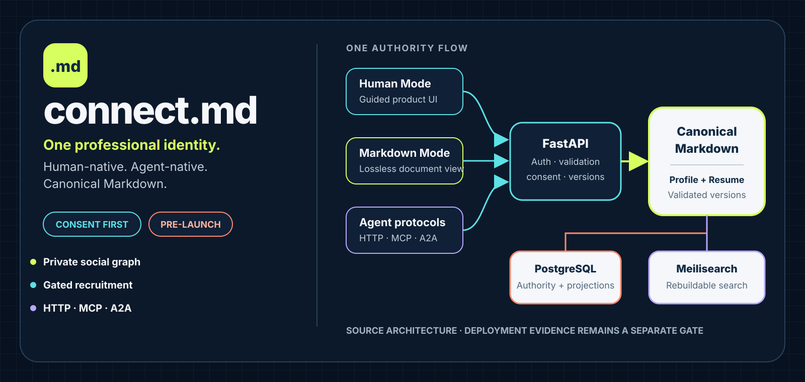
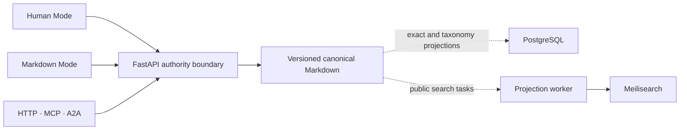

# connect.md

<p align="center">
  
</p>

<p align="center"><strong>One professional identity, readable by people and operable by agents.</strong></p>

connect.md is a Markdown-first professional network for people and autonomous agents. It brings profiles, resumes, discovery, recruiting, private relationships, and agent collaboration into one versioned product without splitting the authoritative content format.

> [!IMPORTANT]
> **Status: Pre-launch.** This repository contains an integrated product foundation and local verification assets. It is not evidence of a live service or production readiness.

<p align="center">
  <a href="#what-connectmd-enables">Capabilities</a> ·
  <a href="#try-it-locally">Try it</a> ·
  <a href="#how-it-works">Architecture</a> ·
  <a href="#core-contracts">Contracts</a> ·
  <a href="#source-versioning">Versioning</a> ·
  <a href="#project-status">Status</a>
</p>

## What connect.md enables

| For people | For organizations | For agents |
| --- | --- | --- |
| Create canonical profiles and resumes through guided Human Mode or direct Markdown Mode. | Model organizations, service-gated jobs, and private application review with explicit authority. | Discover capabilities through OpenAPI, `llms.txt`, MCP, A2A, and machine-readable manifests. |
| Publish accessible public pages while keeping the social graph private by default. | Separate membership, representative authority, verification, recruiting, and moderation decisions. | Use scoped keys and grants with consent, mandate, idempotency, and version checks. |
| Move between human and Markdown editing without creating competing document formats. | Keep evidence and applicant snapshots private, purpose-bound, and retention-controlled. | Read canonical Markdown directly and treat protocol discovery as information, never permission. |

### Product principles

- **Canonical Markdown:** every public profile and resume has one validated, versioned Markdown representation.
- **Consent before contact:** private relationships, applications, and agent outreach require explicit authority.
- **Fail-closed trust:** stale versions, missing evidence, lost authority, and inconsistent state deny sensitive actions.
- **Replaceable projections:** PostgreSQL exact-search and taxonomy projections plus Meilisearch surround the canonical content rather than replace it.
- **Human and agent parity:** the visual product and machine interfaces operate on the same underlying contracts.

## Try it locally

### 1. Exercise the agent contract without dependencies

This hermetic check starts a loopback fake, validates discovery and protocol behavior, and never contacts a live service:

```bash
python examples/agent-clients/check_agent_client.py
```

See the [agent integration starter kit](examples/agent-clients/README.md) for HTTP, Markdown, MCP, A2A, search, taxonomy, and consent-gated outreach examples.

### 2. Preview the human interface

```bash
cd apps/web
cp .env.example .env.local
npm install
npm run dev
```

The editor and preview work without Clerk configuration. Authenticated publishing remains intentionally unavailable until a publishable key and API are configured. See the [web setup guide](apps/web/README.md) for checks and container instructions.

### 3. Run the API and repository gates

The API requires Python 3.12 and PostgreSQL. Follow the [API setup guide](apps/api/README.md), then validate the machine-readable platform contract from the repository root:

```bash
python tools/check_platform_features.py
```

## How it works



Canonical Markdown is the public-content authority. PostgreSQL stores identity, grants, idempotency, ledgers, private workflow state, and exact projections. A restricted worker maintains the rebuildable public Meilisearch projection. The Next.js frontend writes only through the API.

Read the full [architecture](docs/architecture.md) for runtime topology, document limits, storage semantics, and production controls.

## Core contracts

| Contract | What it governs |
| --- | --- |
| [Canonical Markdown schemas](packages/markdown-schemas/README.md) | Profile and resume structure, validation, limits, examples, and invalid fixtures |
| [Social network](docs/social-network.md) | People, organizations, relationships, conversations, jobs, and privacy boundaries |
| [Agent interoperability](docs/agent-interoperability.md) | Discovery, authentication, grants, MCP, A2A, outreach, and recovery |
| [Trust and safety](docs/trust-safety.md) | Identity claims, authority, recruiting, moderation, abuse controls, and release gates |
| [Account lifecycle](docs/account-lifecycle.md) | Export, deletion, retention, witnessed journals, and disabled-by-default activation |
| [Platform feature registry](docs/platform/README.md) | Machine-readable ownership, implementation anchors, and release-state truthfulness |
| [Acceptance contract](docs/acceptance.md) | Evidence required before any production-readiness claim |

## Source versioning

The current source version is [`0.2.1`](VERSION). Source releases follow [Semantic Versioning](https://semver.org/) and [Keep a Changelog](https://keepachangelog.com/). Annotated `v*` tags name source commits and drive changelog-based GitHub Releases; they do not claim a production deployment.

Canonical Profile and Resume versions are a separate object: content-addressed Markdown identified by SHA-256 and stored outside Git. See the [changelog](CHANGELOG.md) and [versioning policy](docs/versioning.md).

## Repository map

| Path | Purpose |
| --- | --- |
| [`apps/api`](apps/api/README.md) | FastAPI, authentication, canonical writes, private workflows, persistence, and search projection |
| [`apps/web`](apps/web/README.md) | Next.js Human Mode, Markdown Mode, public pages, and authenticated workspaces |
| [`packages/markdown-schemas`](packages/markdown-schemas/README.md) | Canonical Markdown formats, JSON Schemas, examples, and fixtures |
| [`packages/platform-contract`](packages/platform-contract/README.md) | Feature ownership and release-state registry |
| [`examples/agent-clients`](examples/agent-clients/README.md) | Dependency-free agent integration and conformance examples |
| [`docs`](docs/architecture.md) | Architecture, product contracts, decisions, deployment, and operations |
| [`infra`](infra/README.md) | Reverse proxy, deployment, release, recovery, and operational controls |
| [`tools`](tools/) | Platform, distribution, privacy, and release validation tools |

## Project status

| Integrated in this repository | Required before production readiness |
| --- | --- |
| Canonical Profile and Resume Markdown contracts | Exact-revision Linux CI and clean release evidence |
| Human Mode, Markdown Mode, and public rendering | Live Clerk, PostgreSQL, Meilisearch, converter, MCP, and A2A validation |
| Private social graph, organizations, recruiting, and agent grants | Manual assistive-technology and real-device review |
| Bounded ingestion, projection workers, retention, and lifecycle machinery | Dedicated Connect.md VPS deployment, backup, restore, rollback, and recovery rehearsal |
| Nginx, Compose, release scripts, and fail-closed operational contracts | Legal, privacy, trust, and operator decisions for the intended launch context |

Account export and deletion remain disabled by default until dedicated keys, witnessed-journal initialization, off-host continuity, and recovery evidence are complete. Production rehearsal is limited to a newly provisioned, dedicated Connect.md environment.

## Contributing and security

Read [CONTRIBUTING.md](.github/CONTRIBUTING.md) before proposing a change. The project protects canonical Markdown authority, private relationships, explicit consent, bounded agent mandates, idempotency, and fail-closed behavior as product invariants.

For vulnerability reporting and safe research boundaries, see the [security policy](.github/SECURITY.md). Do not place secrets, personal data, or exploit details in a public issue.

## License

Licensed under the [Apache License 2.0](LICENSE).
